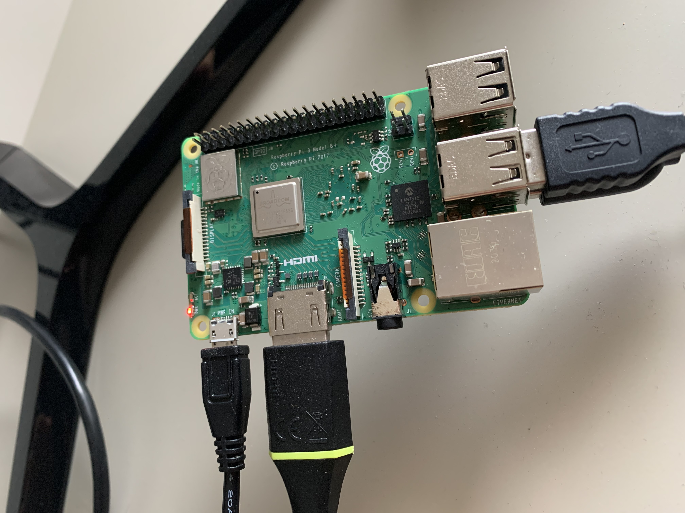
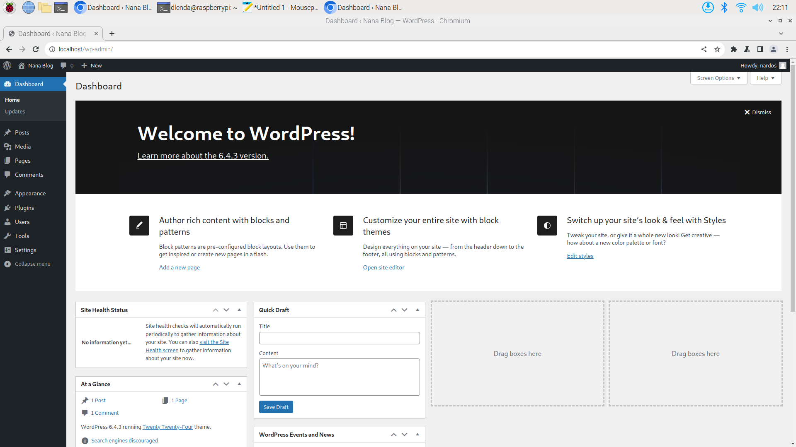

# Raspberry Pi Server

The Raspberry Pi 3model B+ is a small, powerful computer that's great for LAMP projects. It has everything I need to run a LAMP Server : a fast processor, 1GB of RAM, built-in WI-FI, and Ethernet.

Constructing my Raspberry Pi LAMP project  was a captivating endeavour that involved integrating Linux, Apache, MySQL and PHP into cohesive Web Server Environment. I chose this project so I could get better understanding on Linux, terminal and commands along side tailoring the server to suit my personal specific needs which is sharing my writings on the blog.
For the Web server, I used **Linux** as my Operating System, **Apache Web Server** as the Web server Software, **MySQL**for database Management and **PHP** for Programming. The steps are as follows:

**1.Setting up Raspberry Pi:** First making  sure that my Raspberry Pi is connected to power and internet and installing Linux from Raspbian by using the offficial Raspbian images provided by the Raspberry Pi Foundation and writing them to an SD card.

**2.Install apache:** After setting up my Raspberry Pi I started installing Apache by using the following command on my terminal: `sudo apt-get install Apache2`. Once I have got Apache installed, I go to Apache default web page on my raspberry pi and test my Webserver whether its working or not. 

** 3.Installing PHP:** Installing PHP package with `sudo apt-get install php -y` and testing PHP by creating a file in the Apache Web root directory.
 
**4.Installing MySQL:** Installing MySQL by running `sudo apt-get install mariadb-server php-mysql -y`.

Lastly, downloading **Wordpress** and run it as local Website on my Raspberry Pi and make it accessible to other devices on my local network. After setting up and configuring my Wordpress, my Web Server is ready to serve the the Website.

